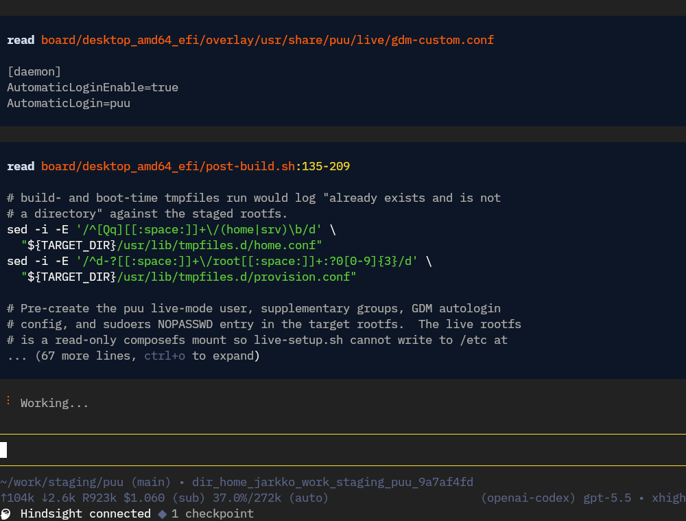

# pi-blackboard-theme

Blackboard theme for Pi, based on the Sublime Text Blackboard color scheme.



## Install

```bash
pi install git:<repository-url>
```

For local development:

```bash
pi install /home/jarkko/work/staging/pi-blackboard-theme
```

Then select the `blackboard` theme in `/settings` or set:

```json
{
  "theme": "blackboard"
}
```

## License

`pi-blackboard-theme` is licensed under `MIT`. See [LICENSE](LICENSE)
for more information.
